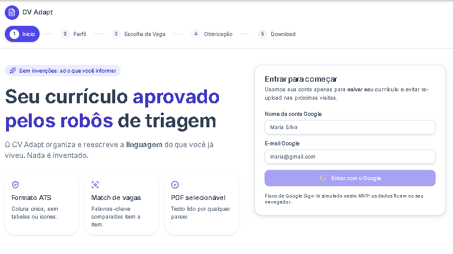
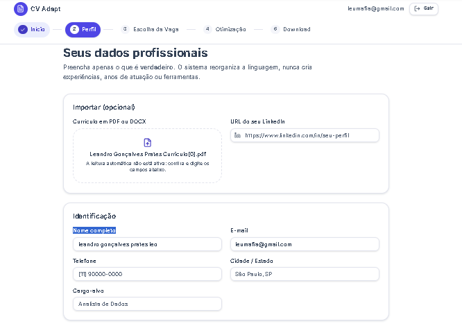
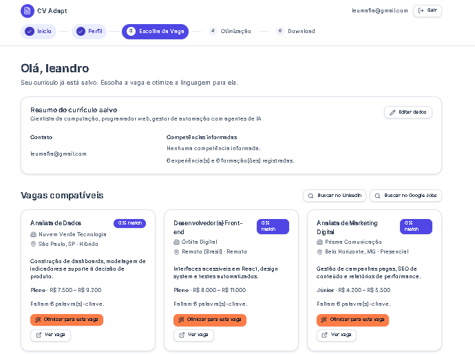
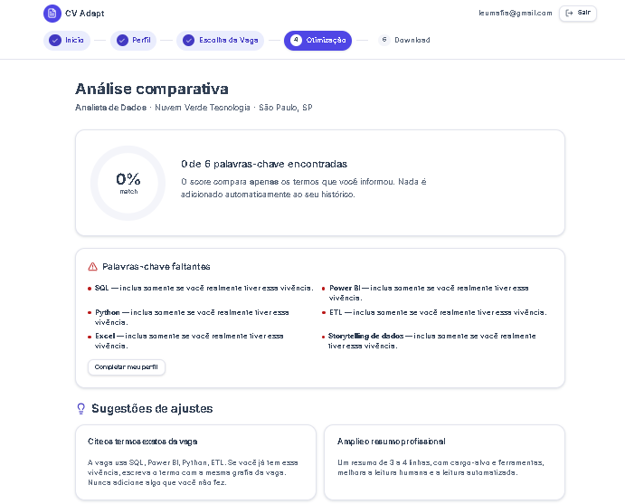

# 📄 CV Adapt - Otimização Estratégica de Currículos

O **CV Adapt** é uma aplicação web desenvolvida como parte do desafio de *Vibe Coding* da **DIO (Digital Innovation One)**, construída através de IA generativa com a plataforma Lovable.

A proposta principal do aplicativo é ajudar candidatos a **adaptarem seus currículos de acordo com a vaga desejada, de forma 100% ética**. Ao analisar a descrição de uma vaga, o sistema cruza os requisitos com o seu perfil e sugere quais dos **seus pontos fortes reais** devem ganhar mais ênfase, garantindo que o seu documento chame a atenção do recrutador sem a necessidade de inventar informações.

🌐 **Acesse o app online:** [cvadapt.lovable.app](https://cvadapt.lovable.app/)

---

## 🚀 Principais Funcionalidades

- **Análise de Vaga Alvo:** Cole a descrição da vaga desejada para que o sistema entenda o que a empresa realmente procura.
- **Adaptação Ética e Estratégica:** Receba sugestões de quais experiências e habilidades do seu histórico devem ser destacadas para criar o "fit" perfeito com a vaga (sem mentir ou "alucinar" dados).
- **Layout Rigorosamente ATS-Friendly:** O currículo final é gerado em uma estrutura limpa (coluna única, fontes clássicas e sem elementos gráficos complexos) projetada para ser lida perfeitamente por robôs de recrutamento.
- **Exportação Inteligente:** Geração de arquivo PDF com texto **selecionável e pesquisável**, garantindo a extração correta de palavras-chave pelos sistemas de RH.

---

## 📸 Demonstração da Interface

> **Nota:** As imagens abaixo ilustram o fluxo principal da aplicação.

### 1. Inserção do Perfil
<!-- Substitua o arquivo 'step1-vaga.png' na pasta 'assets' pela sua captura de tela real -->
, 

### 2. Inserção do Curriculo
<!-- Substitua o arquivo 'step1-vaga.png' na pasta 'assets' pela sua captura de tela real -->
, 

### 3. Sugestões de Vagas
<!-- Substitua o arquivo 'step2-adapt.png' na pasta 'assets' pela sua captura de tela real -->


### 4. Sugestão de Adapitação Currículo
<!-- Substitua o arquivo 'step3-pdf.png' na pasta 'assets' pela sua captura de tela real -->


---

## 🛠️ Tecnologias Utilizadas

- **Frontend:** React + Vite
- **Estilização:** Tailwind CSS
- **Prototipação e Desenvolvimento GenAI:** Lovable (Vibe Coding)
- **Hospedagem:** Lovable App

---

## ⚙️ Como rodar o projeto localmente

Caso deseje clonar o projeto e rodá-lo em sua máquina, siga os passos abaixo:

1. Clone o repositório:
   ```bash
   git clone [https://github.com/Leoprates1/Gerador-de-Curriculos-ATS-Friendly--lovable-/]
